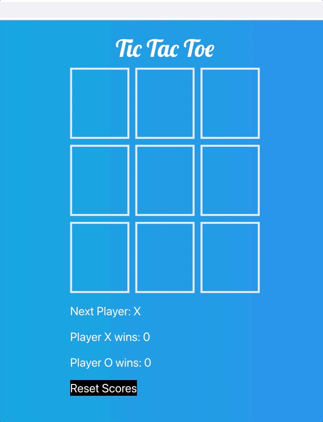

# Tic-Tac-Toe w/ TypeScript and React (with vite)
A simple game created with TS, React and Vite. 

## What I Practiced 🧠: 
-TypeScript 
-Styling with Tailwind 
-Random sorting of arrays 
-Types, types, types! 
-Conditional logic and mapping with React 
-useState and useEffect 

## Preview:
  